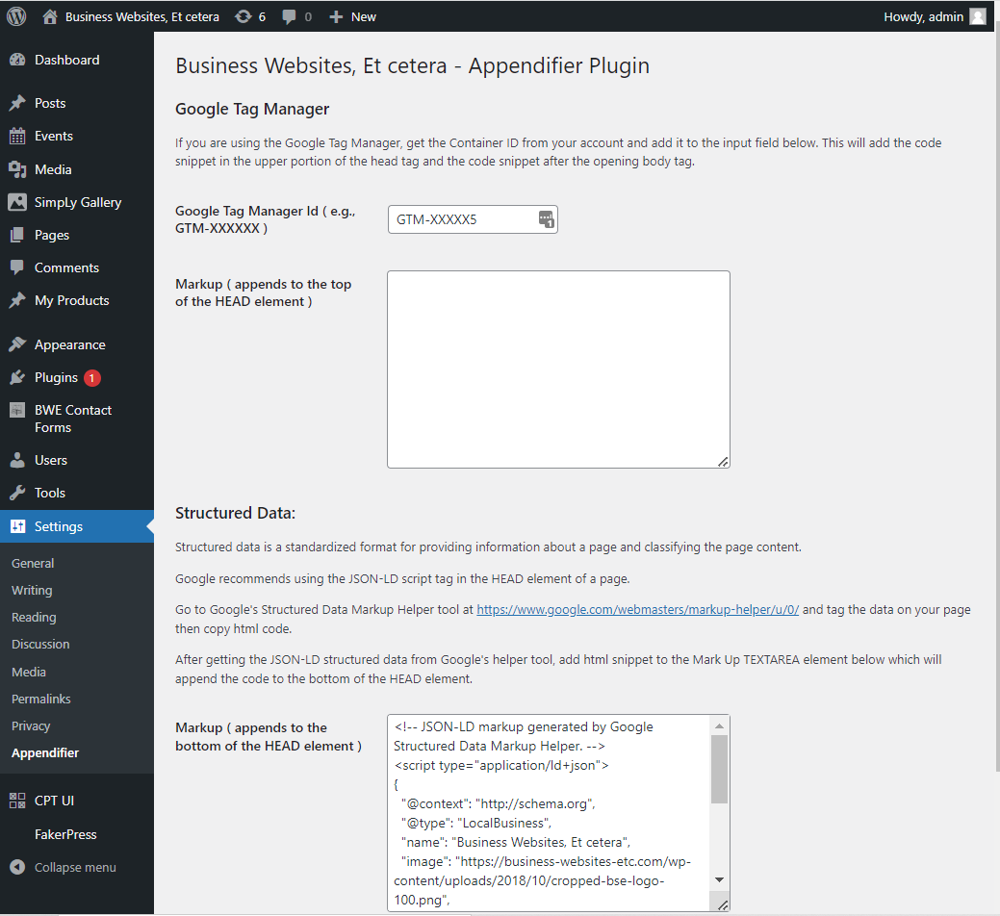

# Appendifier #
**Contributors:** Phil Kane from https://business-websites-etc.com
**Donate link:** https://paypal.me/PhilipKane
**Tags:** Appendifier, append to head tag, google tag manager
**Requires at least:** 5.6
**Tested up to:** 5.9
**Requires PHP:** 7.0
**Stable tag:** 1.1.0
**License:** GPLv2 or later
**License URI:** https://www.gnu.org/licenses/gpl-2.0.html

This plugin allows users to add snippets of code to the head tag.

## Description ##

There is a textarea input to either add code to the upper section of the \<head> tag and one for the lower section.

This can be used to add the older google code snippet or a <script> tag or <style> tag.

## Google Tag Manager ##

If you are using the Google Tag Manager, you can get the Container ID from your google account and add it to an input field. This will add the code snippet in the upper portion of the head tag and the code snippet after the opening body tag.

## Installation ##

1. Upload `bwe_appendifier` to the `/wp-content/plugins/` directory
1. Activate the plugin through the 'Plugins' menu in WordPress
 Or
1. `cd` into your `/wp-content/plugins/` folder and run `git clone https://github.com/philekane/appendifier`
1. Activate the plugin through the 'Plugins' menu in WordPress

## Frequently Asked Questions ##

### Example question? ###

Example answer.

## Screenshots ##

### 1. This screen shot of the Appendifier settings page. ###

== Changelog ==

= 1.1.0 =

* Added input field on setting page in order to add Google Tag Manager code snippets to the head tag and the code snippet after the body tag

## Features ##

1. Add code to the head tag, either at the top of the element or at the bottom.

2. Add Google Tag Manager code snippets to the head tag and the code snippet after the body tag.

